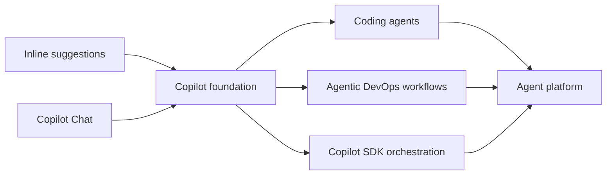

# Module 1 — Day 1 with Copilot

> **Goal:** understand what GitHub Copilot is and learn the VS Code basics: inline suggestions, next suggestions, Copilot Chat, `@`, `#`, `/`, and a first project walkthrough.

> **Audience:** developers and technical learners who are new to Copilot or who have only used inline autocomplete. If you already use Ask, Plan, and Agent modes confidently, continue to [Module 2 — The Three Modes](02-three-modes.md).

---

## Chapter 1.1 — GitHub Copilot in brief

GitHub Copilot is an **AI pair-programming assistant**. In VS Code, you mainly use it in two ways:

- **Inline suggestions** — Copilot suggests code, tests, docs, or config as you type.
- **Copilot Chat** — you ask questions, attach project context, compare approaches, and request small drafts or plans.

Short history:

| Period | Milestone |
|---|---|
| **2021** | Copilot technical preview introduced AI code completion in editors. |
| **2022** | Copilot became generally available and started wider team adoption. |
| **2023** | Copilot Chat brought conversational help into the editor. |
| **2024** | Copilot expanded with richer repository context and customization patterns. |
| **2025–2026** | Copilot expanded into coding agents, agentic workflows, integrations, and SDK-based orchestration. |

Where it is heading: Copilot is evolving from a typing assistant into an **agent platform** for coding agents, agentic DevOps, and workflows beyond coding tasks. GitHub describes Copilot cloud agent as able to research a repository, create a plan, make code changes on a branch, and open a PR; GitHub also positions the Copilot SDK as a way to embed agentic execution into your own applications.

Evidence from GitHub:

- [Copilot cloud agent](https://docs.github.com/en/copilot/concepts/agents/cloud-agent/about-cloud-agent) — research, plan, edit, test, and create PRs on GitHub.
- [Copilot integrations](https://docs.github.com/en/copilot/concepts/tools/about-copilot-integrations) — trigger Copilot cloud agent from tools such as Teams, Slack, Linear, Azure Boards, and Jira.
- [Copilot SDK: execution is the new interface](https://github.blog/ai-and-ml/github-copilot/the-era-of-ai-as-text-is-over-execution-is-the-new-interface/) — embed programmable agentic execution inside applications.
- [GitHub Agentic Workflows](https://github.blog/ai-and-ml/github-copilot/improving-token-efficiency-in-github-agentic-workflows/) — run and optimize agentic workflows in repository/CI contexts.



---

## Chapter 1.2 — Setup check

Before starting, complete [Module 0 — Prerequisites](00-prerequisites.md). Then confirm:

| Check | How |
|---|---|
| Copilot is installed | VS Code Extensions → “GitHub Copilot”. |
| You are signed in | Copilot status icon is active. |
| Chat works | Open Copilot Chat and send `hello`. |
| The repo is open | Workspace root contains `app/`, `tests/`, `docs/`, `specs/`, and `.github/`. |
| Tests can run | `uv run pytest` or your environment's equivalent. |

Quick verification flow:

1. Open `app/main.py`.
2. Start typing a short comment or helper name and pause.
3. Confirm grey inline suggestion text appears.
4. Press `Esc` to dismiss it, or `Tab` to accept only if you have read it.
5. Open Copilot Chat and ask: `Explain what this repository is.`

If setup fails, fix it before continuing.

---

## Chapter 1.3 — Inline suggestions in the editor

Inline suggestions are the lowest-friction Copilot surface. You do not need a chat prompt. You type code, YAML, Markdown, or shell comments, and Copilot suggests the next line or block directly in the editor.

Copilot suggestions appear as grey **ghost text** after your cursor. You stay in control:

| Action | Common shortcut | What it does |
|---|---|---|
| Accept suggestion | `Tab` | Inserts the visible suggestion. |
| Dismiss suggestion | `Esc` | Hides the current suggestion. |
| Show next suggestion | `Alt+]` | Cycles to another completion candidate. |
| Show previous suggestion | `Alt+[` | Goes back to the previous candidate. |
| Open completions panel | `Ctrl+Enter` | Shows multiple suggestions in a side panel when available. |

Shortcuts can vary by OS, keyboard layout, or VS Code profile. If one does not work, open **Keyboard Shortcuts** and search for “Copilot” or “inline suggestion.”

Copilot can also suggest a **next edit** after you make a related change. For example, if you rename a response field in one test, Copilot may suggest the next matching update elsewhere. Treat this as a follow-up hint: read it, accept the useful part, or dismiss it.

Configuration is covered in [Chapter 1.5 — Configure Copilot and Chat in VS Code](#chapter-15--configure-copilot-and-chat-in-vs-code).

Try these quick examples in a scratch area or a branch you can reset:

| Try | What to watch for |
|---|---|
| In `tests/test_main.py`, start writing a test name such as `def test_healthz_` | Copilot may infer route names and assertions from nearby tests. |
| In `app/models.py`, type a Pydantic field comment | Copilot may suggest field names and descriptions consistent with the models. |
| In `specs/api-health-observability.spec.md`, start a checklist item | Copilot may continue in the existing spec style. |
| In `README.md`, add a draft sentence under local run instructions | Copilot may propose commands that need verification. |

Tip: read suggestions before accepting, and use `Alt+]` / `Alt+[` before rewriting by hand.

---

## Chapter 1.4 — Copilot Chat in VS Code

Copilot Chat is where you ask questions and provide context. Start in **Ask Mode** for explanation and comparison.

| Symbol | Use it for | Example |
|---|---|---|
| `@` | Route the question to a participant or agent. | `@workspace Where is /readyz implemented?` |
| `#` | Attach context such as a file, selection, folder, or symbol. | `Compare #app/main.py and #tests/test_main.py` |
| `/` | Run a built-in command or project prompt. | `/explain`, `/tests`, `/fix`, `/review-azure-deployment` |

Most useful examples:

| Symbol | Try this | Good for |
|---|---|---|
| `@` | `@workspace Give me a 5-bullet map of this repo.` | Fast project orientation. |
| `@` | `@workspace Where are /healthz and /readyz implemented and tested?` | Tracing behavior across files. |
| `@` | `@vscode How do I change Copilot inline suggestion shortcuts?` | VS Code settings and shortcuts. |
| `#` | `Explain #app/main.py in plain English.` | File-level explanation. |
| `#` | `Compare #app/main.py and #tests/test_main.py.` | Connecting implementation to tests. |
| `#` | `Summarize #selection and suggest a clearer name.` | Working with selected code or text. |
| `/` | `/explain #app/main.py` | Quick explanation command. |
| `/` | `/tests for the selected function` | Test-generation starting point. |
| `/` | `/review-azure-deployment` | Running a project prompt file when available. |

Available `@`, `#`, and `/` options vary by VS Code version, Copilot plan, installed extensions, and repo prompt files. Type the symbol and use the picker to see what your environment supports.

Useful habits:

- Name the task: explain, summarize, compare, draft, plan, or suggest.
- Attach the files Copilot should use.
- Ask for a format: bullets, table, checklist, or short note.
- Ask for evidence: “mention which file supports each claim.”
- Keep one goal per prompt.

Useful VS Code entry points: search “Copilot” in the Command Palette for Chat, Explain This, Generate Tests, and Toggle Completions.

---

## Chapter 1.5 — Configure Copilot and Chat in VS Code {#chapter-15--configure-copilot-and-chat-in-vs-code}

Use these VS Code entry points when you need to change Copilot behavior:

| Configure | Where to go | Use it for |
|---|---|---|
| Copilot extension | Extensions → “GitHub Copilot” | Install, update, disable, or inspect extension details. |
| Account status | Copilot status icon or VS Code Accounts menu | Sign in, confirm license status, or troubleshoot auth. |
| Copilot settings | Settings → search “GitHub Copilot” | Inline suggestions, language enablement, next edit suggestions. |
| Copilot Chat settings | Settings → search “Copilot Chat” or “Chat” | Chat behavior, agent/mode options, and related feature toggles. |
| Keyboard shortcuts | Keyboard Shortcuts → search “Copilot” | Accept suggestions, cycle suggestions, open Chat, or run Copilot commands. |
| Chat panel controls | Copilot Chat panel | Choose Ask/Plan/Agent mode, pick an agent, and select a model when available. |

Setting names and available toggles can vary by VS Code version, Copilot plan, and organization policy. If your environment is managed, keep the defaults unless your instructor or admin tells you otherwise.

---

## Chapter 1.6 — Day-1 exercise

Use Ask Mode with this prompt:

```text
Summarize this existing v1 project for a new learner.
Use README.md, app/main.py, tests/test_main.py, specs/api-health-observability.spec.md, and docs/00-prerequisites.md.
Include API behavior, local validation, Azure deployment examples, and how the training exercises are organized.
Return a concise onboarding note.
```

Check the answer against the file tree, then save one short takeaway.

---

## Chapter 1.7 — Day-1 checklist

- [ ] You can explain Copilot as inline suggestions plus Chat.
- [ ] You know the short history: completion → Chat → coding agents, agentic workflows, and SDK orchestration.
- [ ] You have accepted, dismissed, and cycled an inline suggestion.
- [ ] You know where to check Copilot and Copilot Chat settings in VS Code.
- [ ] You can explain what `@`, `#`, and `/` do in Chat.
- [ ] You have asked Copilot to explain `app/main.py` or `tests/test_main.py`.
- [ ] You have saved one short orientation note for `copilot-ml`.

---

> **Back:** [Module 0 — Prerequisites](00-prerequisites.md)  
> **Next:** [Module 2 — The Three Modes](02-three-modes.md)