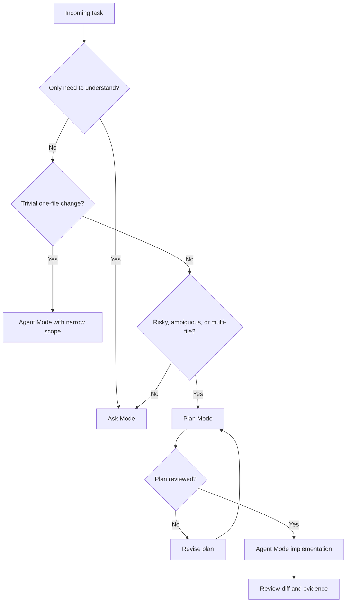

# Module 2 — The Three Modes: Ask, Plan, Agent

> **Goal:** by the end of this module, you can choose Ask, Plan, or Agent mode for the right reason and run a small implementation safely.

All demos start from the existing v1 project in the repository root:

`copilot-ml/`

---

## Chapter 2.0 — Mode choice mental model and demo context

Use this customer-safe task to explain the difference between explanation, planning, and supervised execution:

> Improve the readiness endpoint test coverage for the existing v1 demo API without changing deployment behavior.

This task is small enough to implement, but still useful for showing the difference between explanation, planning, and execution on a brownfield codebase.

Modern Copilot Chat in VS Code gives you three working modes. Pick the mode based on **intent**, not on how impressive the task sounds.

| Mode | What it is | Edits files? | Runs commands? | Best for |
|---|---|---:|---:|---|
| **Ask** | Conversational Q&A over code, docs, and concepts. | No | No | Understanding, comparison, review comments, learning. |
| **Plan** | Read-only research and structured implementation planning. | No | Usually no | Multi-step or uncertain work before implementation. |
| **Agent** | Supervised coding workflow that can read, edit, run commands, and iterate. | Yes | Yes | Approved implementation, tests, small refactors, repeatable fixes. |

### How to think about the scenario

Break the scenario into smaller intents:

| Request | Better mode | Why |
|---|---|---|
| “What does `/readyz` return?” | Ask | You only need explanation. |
| “Which test assertion should we add?” | Plan | You want a reviewable approach before editing. |
| “Add the approved assertion and run tests.” | Agent | The scope is clear and implementation is allowed. |
| “Deploy to Azure and clean up failed resources.” | Human-owned workflow | This changes live infrastructure state and should not be delegated from a training chat. |

### Demo — classify the task

Ask Copilot:

```text
For copilot-ml, classify these requests as Ask, Plan, or Agent:
1. Explain what /readyz returns.
2. Plan one new readiness test assertion.
3. Implement the approved test assertion.
4. Deploy to Azure and delete failed resources.
Explain why, and mention what extra information each mode needs.
```

Expected result:

- Explanation → Ask.
- Test plan → Plan.
- Approved test edit → Agent.
- Deploy/delete → not an autonomous agent task in this workshop.

---

## Chapter 2.1 — Ask Mode

Ask Mode is for learning and review. It does not edit files.

Use Ask Mode when:

- You need a file, endpoint, test, or workflow explained.
- You want to compare approaches before deciding.
- You are unsure whether a task is ready for Plan or Agent Mode.
- You want a second opinion before changing code.

Ask Mode output should be a decision aid, not a diff.

### Ask prompt pattern

```text
Explain or review <specific target>.
Use <files, selection, or repo context>.
Return <format>.
Do not edit files.
```

Useful examples:

| Request type | Example |
|---|---|
| Explain | `Explain #app/main.py in plain English. Mention each route.` |
| Trace | `Where is /readyz implemented and where is it tested?` |
| Compare | `Compare #app/main.py and #tests/test_main.py. What behavior is covered?` |
| Review | `Review this test file for missing readiness assertions. Do not edit.` |
| Summarize | `Summarize this repo for a new learner in 8 bullets.` |

### Demo — Ask Mode explanation

Prompt:

```text
Explain /healthz and /readyz in app/main.py.
What would an SRE trust from these endpoints, and what still needs human validation?
Do not edit files.
```

Expected output:

- Clear endpoint explanation.
- An SRE could trust these endpoints as lightweight application self-reporting.
- The answer separates “what the code says” from “what still needs real environment validation.”

---

## Chapter 2.2 — Plan Mode

Plan Mode is for risky, multi-step, or multi-file work. It produces a reviewable plan before implementation.

Use Plan Mode when:

- The task touches more than one file or component.
- You are not sure where the right change belongs.
- You need to compare possible approaches before editing.
- The change affects tests, API behavior, deployment config, or docs that learners rely on.
- You want a plan that a teammate can review or implement later.

The Plan Mode loop is:

```text
prompt → inspect → ask questions → draft plan → human review → revise plan → approve or stop
```

Do not treat the first plan as permission to implement. Read it, challenge it, and narrow it.

A strong Plan Mode prompt has four core parts, plus a questions field for ambiguity:

| Part | Purpose | Demo project example |
|---|---|---|
| Scope | What should change? | “Add one readiness test assertion.” |
| Existing context | What should Copilot inspect or reuse? | `app/main.py`, `app/models.py`, `tests/test_main.py`. |
| Out of scope | What must not change? | No Azure deployment, no auth, no real dependency. |
| Acceptance | How is “done” proven? | `pytest` passes and only expected files changed. |
| Questions | What is still unclear? | Ask before writing the final plan. |

### Plan Mode prompt template

```text
[SCOPE]
I need to <verb> <specific behavior> in <file or area>.

[EXISTING CONTEXT]
Reuse existing patterns from <file>, <test>, or <doc>.

[OUT OF SCOPE]
Do not change <things that should not move>.

[ACCEPTANCE]
Done when <specific result> and <verification command> passes.

[QUESTIONS]
If anything is ambiguous, ask before writing the plan.
```

### How to review a plan

Before implementation, check:

| Review question | What good looks like |
|---|---|
| Is the scope concrete? | The plan names `tests/test_main.py` and the exact behavior under test. |
| Is verification explicit? | The plan says to run `pytest` or the project’s equivalent. |
| Are assumptions visible? | Unknowns are listed instead of hidden. |
| Is out-of-scope respected? | No deployment, auth, dependency, or unrelated refactor appears. |
| Is rollback simple? | Revert the test change if it is wrong. |

If the plan has no open questions, ask: “What assumptions are you making that could be wrong?”

### Demo — create a plan

Prompt:

```text
Plan how to add one test assertion that /readyz returns demo dependency statuses.

Use:
- app/main.py
- app/models.py
- tests/test_main.py

Include files to inspect, exact test command, out-of-scope, rollback, and open questions.
Do not implement.
```

Expected plan:

- Only `tests/test_main.py` is likely to change.
- Verification is `pytest`.
- Out-of-scope includes deployment, auth, and real dependencies.
- Rollback is reverting the test change.

---

## Chapter 2.3 — Agent Mode

Agent Mode can edit files and run commands. Use it after the plan is accepted, or for a very small implementation where the scope is already obvious.

An Agent Mode session usually follows this loop:

```text
prompt → inspect files → plan local steps → edit → run validation → fix errors → summarize evidence
```

You can stop or redirect the session at any time. The best time to intervene is early, before the agent builds on a wrong assumption.

### Agent prompt formula

```text
Implement <approved change>.
Edit only <allowed files>.
Use <existing pattern or plan>.
Run <local validation command>.
Do not change <out-of-scope items>.
Stop and summarize <diff + evidence>.
```

### Watch during the session

Check these moments early:

| Moment | What to check |
|---|---|
| First file reads | Are they the files named in the prompt or plan? |
| First edit | Is the edit inside the expected file and test? |
| First command | Is it the agreed local validation command? |
| Final summary | Does it cite evidence, or only say “done”? |

Stop and restate the scope if it reads unrelated folders, edits unexpected files, repeats the same failure, or claims success without a command result.

### Demo — implement one approved test change

Prompt:

```text
Implement only the approved readiness test assertion from the plan.
Edit tests/test_main.py only.
Run pytest.
Do not change app code, Azure files, Docker files, docs, or workflows.
Stop and summarize the diff and test result.
```

Expected behavior: one test-file edit, local tests only, and a final summary with evidence.

---

## Chapter 2.4 — Mode decision table

| Situation | Use | Demo project example | First prompt shape |
|---|---|---|---|
| Need explanation | Ask | Explain `app/main.py`. | `Explain #app/main.py. Do not edit.` |
| Need comparison | Ask | Compare implementation and tests. | `Compare #app/main.py and #tests/test_main.py.` |
| Need a safe approach | Plan | Plan a readiness test update. | `Plan one assertion; include out-of-scope and verification.` |
| Approved small edit | Agent | Edit `tests/test_main.py` and run `pytest`. | `Implement only the approved assertion.` |
| Needs live deployment | Human-approved workflow | Review Bicep, but do not deploy from chat. | `Review the deployment plan; do not run deploy commands.` |

### Decision flow

Use these questions before choosing a mode:

1. **Do I only need to understand?** Use Ask.
2. **Is the task a trivial one-file change with obvious behavior?** Agent can be enough.
3. **Is the task risky, ambiguous, unfamiliar, or multi-file?** Use Plan first.
4. **Is the plan reviewed and acceptance clear?** Use Agent for a scoped edit.
5. **Does the task require live cloud mutation, secrets, merge, or deletion?** Keep it human-owned.



---

## Chapter 2.5 — Copyable mini-prompts

Mode shortcuts and names can vary by VS Code and Copilot version. If a slash command is unavailable, use the Chat mode dropdown and type the same intent in plain English.

```text
Ask: Explain #app/main.py and mention which tests cover each route. Do not edit.
```

```text
Plan: Plan one readiness test improvement using app/main.py and tests/test_main.py. Include scope, out-of-scope, verification, rollback, and open questions. Do not implement.
```

```text
Agent: Implement only the approved readiness test change. Edit tests/test_main.py only. Run pytest. Summarize the diff and result.
```

---

## Chapter 2.6 — Lab connection

Use [Lab 2 — Ask, Plan, and Agent mode on the demo project](09-workshop-and-labs.md#lab-2--ask-plan-and-agent-mode-on-the-demo-project) in Module 9.

---

> **Next:** [Module 3 — Pick the Right Model](03-pick-the-right-model.md)
> **Back:** [Module 1 — Day 1 with Copilot](01-day-1-with-copilot.md)
