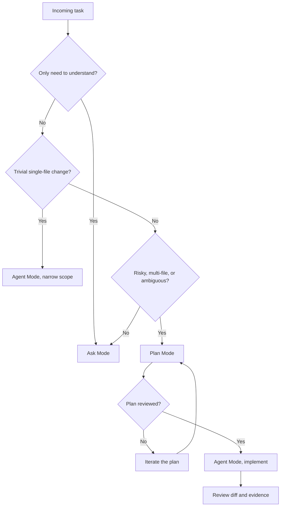

# Module 2 — The Three Modes: Ask, Plan, Agent

GitHub Copilot Chat in VS Code is not one thing — it is a set of agents that share the same chat window but behave very differently. Some answer questions and never touch a file. Some research a multi-file change and hand you a plan. Some open files, edit them, run tests, and iterate until the task is done.

Picking the wrong one is the most common source of wasted Copilot time. A quick "what does this endpoint return?" should not turn into a 20-tool-call refactor; a risky deployment change should not be left to a single auto-prompt. This module covers the three built-in agents — **Ask**, **Plan**, and **Agent** — and gives you a way to decide between them for any incoming task.

The examples come from this workshop's demo project. A small, customer-safe scenario runs through the module:

> Improve the readiness endpoint test coverage for the existing v1 demo API without changing deployment behavior.

It is small enough to implement in a few minutes, but big enough to show the difference between explanation, planning, and supervised execution.

Official VS Code references:

- [Chat overview](https://code.visualstudio.com/docs/copilot/chat/copilot-chat)
- [Choose an agent](https://code.visualstudio.com/docs/copilot/agents/overview)
- [Planning with agents](https://code.visualstudio.com/docs/copilot/agents/planning)

---

## The three modes at a glance

You select the agent from the agent picker at the bottom of the Chat view. Each agent is optimized for a different intent.

| Agent | Edits files? | Runs commands? | Typical session | Best for |
|---|---:|---:|---|---|
| **Ask** | No | No | 1–3 turns | Explanations, comparisons, learning, "what does this do?" |
| **Plan** | No | Read-only tools only | 3–10 turns of clarification | Multi-file or risky work, anything you would otherwise just "think out loud" before coding |
| **Agent** | Yes | Yes | 5–50+ tool calls | Approved implementation, refactors, bug fixes, scaffolding |

Two related concepts come up later:

- **Subagents** — invoked from inside an Agent session to delegate a long read or research task into an isolated context window. The subagent runs to completion and returns only its final result, so it does not pollute the main session.
- **Custom agents** — `.agent.md` files that pin a persona, tool list, and model. They appear in the agent picker alongside Ask, Plan, and Agent. We cover them in [Module 5](05-customize-agents-skills-mcp.md).

Pick the mode based on *intent*, not on how impressive the task sounds.

---

## Ask Mode

Ask Mode is the conversational baseline. It answers questions about code, libraries, and concepts. It never edits files or runs commands, so it is the safest place to start when you are still figuring out what you want.

Reach for Ask Mode when:

- You need an existing file, endpoint, test, or workflow explained.
- You want to compare two approaches before deciding.
- You want a review opinion without any changes.
- The answer is short enough that you will write the code yourself.

A good Ask prompt names a specific target and tells Copilot what shape the answer should take:

```text
Explain or review <specific target>.
Use <files, selection, or repo context>.
Return <format>.
Do not edit files.
```

Useful variations you will use often:

| Intent | Example |
|---|---|
| Explain | `Explain #app/main.py in plain English. Mention each route.` |
| Trace | `Where is /readyz implemented and where is it tested?` |
| Compare | `Compare #app/main.py and #tests/test_main.py. What behavior is already covered?` |
| Review | `Review this test file for missing readiness assertions. Do not edit.` |
| Summarize | `Summarize this repo for a new learner in 8 bullets.` |

Cost-wise, Ask Mode is the cheapest of the three: single-turn, no tool calls, no follow-ups.

### Demo — explain the health endpoints

```text
Explain /healthz and /readyz in app/main.py.
What would an SRE trust from these endpoints, and what still needs human validation?
Do not edit files.
```

Expected output: a clear explanation of both endpoints, and a useful separation between "what the code says" and "what still needs validation against a real environment."

---

## Plan Mode

Plan Mode is a read-only research agent. It uses search, file reads, and (optionally) web lookups to investigate a request, asks one or two clarifying questions, and produces a structured implementation plan — but it does not edit files or run commands. The heavy execution happens later, usually in an Agent Mode session that consumes the plan.

That is the right shape for most non-trivial work. Plan Mode forces you to slow down, surfaces assumptions before you write code, and produces an artifact your teammates (or your future self) can review.

Reach for Plan Mode when:

- The task touches more than one file or component.
- You are not yet sure of the approach.
- The change is risky or hard to revert — schema changes, auth flow, deployment config, public API.
- You want a shared artifact someone else can review before any code is written.
- You will hand the work off to another developer or to an asynchronous coding agent.

### What a good Plan Mode prompt looks like

A bad Plan Mode prompt:

> *Improve readiness test coverage.*

A good Plan Mode prompt — the demo scenario — names the files, reuses existing patterns, and states what is out of scope:

> *Plan how to add one test assertion that `/readyz` returns demo dependency statuses. Reuse the existing test style in `tests/test_main.py` and the response model in `app/models.py`. Out of scope: changing `app/main.py` behavior, adding new dependencies, touching Azure or Docker files. Acceptance: `pytest` passes and only `tests/test_main.py` changes. If anything is ambiguous, ask before writing the plan.*

A reusable template:

```text
[SCOPE]
I need to <verb> <specific behavior> in <file or area>.

[EXISTING CONTEXT]
Reuse existing patterns from <files>.

[OUT OF SCOPE]
Do not change <things that should not move>.

[ACCEPTANCE]
Done when <specific result> and <verification command> passes.

[QUESTIONS]
If anything is ambiguous, ask before writing the plan.
```

### Reviewing the plan

Plan Mode produces a draft plan with a summary, ordered steps, and (usually) open questions. Do not accept the first plan. Walk through it with these checks:

- **Step granularity** — each step should be reviewable in isolation. "Add an assertion" is right-sized; "Improve `/readyz`" is too big.
- **Verification** — every plan should end with how you will know it worked: `pytest`, a curl, a smoke probe.
- **Open questions** — if the plan has none, the model is over-confident. Ask, "what assumptions are you making that could be wrong?"
- **Blast radius and rollback** — for anything that touches real infrastructure, the plan should call out what fails if step N breaks and how to revert.
- **Test-first ordering** — prefer plans that add or run a failing check before the change steps.

When the plan looks right, use the **Start Implementation** button to hand it to Agent Mode, or **Open in Editor** to save it as `docs/plans/<task>.plan.md` for a teammate or an async agent.

### When *not* to use Plan Mode

Plan Mode has overhead. Skip it when:

- The change is a typo, a one-line config, a dependency bump, or a doc tweak.
- You have already done this exact task before in the same repo. (Save the procedure as a prompt file from [Module 4](04-customize-instructions-prompts-and-hooks.md) instead.)
- You are exploring a throwaway prototype where speed matters more than rigor.

### Demo — produce a plan

```text
Plan how to add one test assertion that /readyz returns demo dependency statuses.
Use app/main.py, app/models.py, and tests/test_main.py.
Include files to inspect, the exact test command, what is out of scope, rollback, and open questions.
Do not implement.
```

Expected plan: only `tests/test_main.py` is likely to change, verification is `pytest`, deployment and auth are out of scope, rollback is reverting the test change, and any ambiguity (which exact assertion shape, what `/readyz` already returns) shows up as an open question.

---

## Agent Mode

Agent Mode is the autonomous coding agent. You give it a task and it reads files, edits them, runs commands, observes the results, fixes errors, and iterates until the task is complete or it gets stuck. It is the right mode once you already know what you want — either because the change is small enough to hold in your head, or because you just finished a Plan Mode session and are executing the plan.

Reach for Agent Mode when:

- The change is small and the behavior is obvious.
- You have an approved plan and you want it implemented.
- The task is multi-step but bounded: edit a few files, run the tests, fix the failures, summarize.
- You want Copilot to autonomously decide which files to touch and in what order.

### The Agent Mode loop

When you submit a prompt, the agent:

1. Reads your prompt, the workspace summary, available tools, and any custom instructions.
2. Plans a sequence of tool calls (read files, edit files, run terminal commands).
3. Executes them, observing each result.
4. Detects failures (compile errors, test failures, terminal exit codes) and self-corrects.
5. Continues until the task is complete or it stops to ask you.

You see the reasoning and tool calls inline; you can pause, edit, or stop the session at any time. The best time to intervene is early, before the agent builds on a wrong assumption.

### A practical Agent Mode prompt

```text
Implement <approved change>.
Edit only <allowed files>.
Use <existing pattern or plan>.
Run <local validation command>.
Do not change <out-of-scope items>.
Stop and summarize <diff + evidence>.
```

### Best practices, in order

A short checklist that has saved teams a lot of wasted credits:

**Before you submit**

- If the task is multi-file or risky, run Plan Mode first.
- Open or `#file:`-mention the files you want it to read; close the noise.
- If the repo has no `copilot-instructions.md`, run `/init` first (see [Module 4](04-customize-instructions-prompts-and-hooks.md)).
- Disable tools you do not need in this session. Unused tools are dead tokens (see [Module 3](03-pick-the-right-model.md)).

**During the session**

- Watch the first one or two tool calls. If the agent reads the wrong files or invents a non-existent module, stop and clarify. Letting it run for 20 turns on a wrong read wastes credits.
- Approve terminal commands deliberately. Auto-approve only safe, read-only commands (`pytest`, `git diff`, `kubectl --dry-run`, `terraform plan`). Never auto-approve writes against shared infrastructure — `az deployment`, `terraform apply`, `helm upgrade`, `kubectl apply/delete`, `git push --force`.
- Push back on hand-waving. If the agent says "I will add appropriate assertions," make it concrete: which assertion, on which response field, with which expected value.
- Stop early. A session running for 30+ tool calls with no measurable progress is usually stuck. Stop, summarize what was learned, and re-prompt.

**After the session**

- Review the diff as if a human wrote it. AI-generated PRs hide their assumptions in plausible-looking code.
- Re-run the tests yourself. Do not trust "tests pass" without re-running locally or in CI.
- Replace the agent's commit message with a tight summary of *why*.
- Capture reusable patterns. If you typed the same multi-paragraph prompt twice, save it as a prompt file (see [Module 4](04-customize-instructions-prompts-and-hooks.md)).

### Subagents

Subagents are an underused superpower. Use one whenever the parent session would otherwise need to read a lot of material that does not need to live in the main context window — codebase exploration, reading several runbooks, summarizing many small files. The subagent runs to completion in its own context and returns only its final summary.

A typical invocation:

```text
Use a subagent to read every prompt file in .github/prompts/ and summarize what each one does, who would use it, and whether any two overlap.
```

### Demo — implement one approved change

```text
Implement only the approved readiness test assertion from the plan.
Edit tests/test_main.py only.
Run pytest.
Do not change app code, Azure files, Docker files, docs, or workflows.
Stop and summarize the diff and test result.
```

Expected behavior: one test-file edit, local `pytest` run, and a final summary that cites the diff and the test output as evidence.

---

## Decision flow

For any incoming task, this is the question order:

1. **Do I only need to understand?** → Ask Mode.
2. **Is this a trivial single-file change with obvious behavior?** → Agent Mode is enough.
3. **Is the task multi-file, risky, ambiguous, or unfamiliar?** → Plan Mode first, then Agent Mode.
4. **Is the plan reviewed and acceptance criteria clear?** → Agent Mode for the implementation.
5. **Does the task require live cloud mutation, secret access, merging, or deletion?** → Keep it human-owned. Use Ask or Plan to review the change; do not execute it from chat.



A textual restatement for the demo project:

| Situation | Use | Demo example |
|---|---|---|
| Need explanation | Ask | "Explain `app/main.py`." |
| Need a safe approach | Plan | "Plan one readiness test improvement." |
| Approved small edit | Agent | "Edit `tests/test_main.py` and run `pytest`." |
| Needs live deployment | Human-owned workflow | Review Bicep — never deploy from chat. |

---

## Anti-patterns to call out

These are the failure modes worth surfacing during a workshop. The first one matters most.

| Anti-pattern | What it looks like | Fix |
|---|---|---|
| **Unsupervised production change** | The agent runs `az deployment`, `terraform apply`, `helm upgrade`, or any state-mutating command against a real environment | Never auto-approve mutating cloud/cluster commands. Restrict the tool list of any agent that can reach prod, or move to a custom agent that only runs `plan` / `diff` / `--dry-run` variants ([Module 5](05-customize-agents-skills-mcp.md)). |
| **Runaway loop** | The agent retries the same failing tool 20+ times | Stop the session, read the last error, fix the missing permission/path/tool, then re-prompt. |
| **Over-confident plan** | A long plan with no open questions and no rollback step | Reject it. Ask, "what assumptions are you making? what could go wrong? what is the rollback?" |
| **Phantom completion** | The summary says "✅ tests pass" but you never saw the command output | Re-run the verification yourself. Do not merge on the agent's word. |
| **Silent scope creep** | The agent "while it was there" refactors files that were not in scope | Stop, revert the unrelated changes, re-prompt with explicit out-of-scope. |
| **Tool sprawl** | Every MCP server enabled "just in case", every tool always on | Audit the tool picker per session. Each unused tool's schema is in every request (see [Module 3](03-pick-the-right-model.md)). |

---

## Quick reference

A one-screen summary suitable for a slide or a `CONTRIBUTING.md` snippet.

```text
Decision:
  Trivial 1-file change?    → Agent Mode
  Need to understand?       → Ask Mode
  Multi-file or risky?      → Plan Mode → Agent Mode
  Touches prod state?       → Ask / Plan only; never auto-execute

Production safety:
  Never auto-approve apply / upgrade / delete / push.
  Allow-list only plan / diff / dry-run / get / pytest.

Context:
  #file:<path>   #folder:<path>   #selection   #problems
  Drag files into chat. Close noise. Run /init for the repo.

Subagents:
  Use for big reads / long research that should not pollute the main context.
```

---

## Summary

Ask, Plan, and Agent are three different tools that share one chat window. Ask is for understanding, Plan is for de-risking and producing a shared artifact before any code is written, and Agent is for supervised execution. The single most leveraged habit is to run Plan Mode before any multi-file or risky change, review the plan carefully, and only then hand it to Agent Mode. Keep destructive infrastructure changes human-owned. With those habits in place, Copilot's three modes become a predictable workflow instead of a guessing game.

For the hands-on lab that walks through the readiness scenario end to end, see [Lab 2 in Module 15](15-workshop-and-labs.md#lab-2--ask-plan-and-agent-mode-on-the-demo-project).

---

> **Next:** [Module 3 — Pick the Right Model](03-pick-the-right-model.md)
> **Back:** [Module 1 — Day 1 with Copilot](01-day-1-with-copilot.md)
