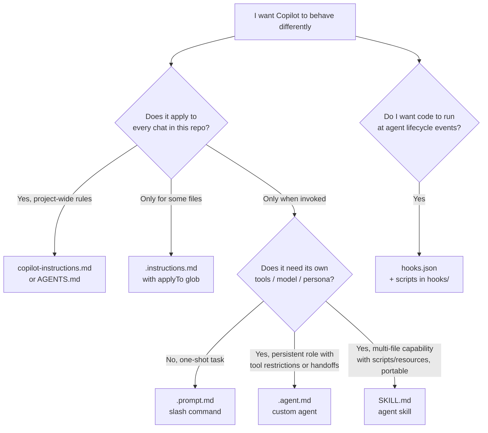

# Module 4 — Customize Copilot: Instructions, Prompt Files & Hooks

Out of the box, GitHub Copilot generates suggestions from its training data and the immediate code context. That works for many one-off tasks, but it does not know that *this* repo is a FastAPI service deployed to a low-cost Azure Container App, that the test command is `pytest`, or that nobody on the team is allowed to run `az group delete` from an agent. Without customization, you end up repeating the same context in every prompt, and Copilot's suggestions still drift away from team conventions.

VS Code lets you embed that project knowledge directly into Copilot using four lightweight primitives:

- **Custom instructions** — Markdown files that give Copilot always-on rules for the repo, a folder, or a file pattern.
- **Prompt files** — reusable prompt templates that show up as slash commands in Copilot Chat.
- **Agent hooks (Preview)** — JSON-defined shell commands that run at specific points in an agent session.
- **Custom agents and skills** — heavier customizations covered in [Module 5](05-customize-agents-skills-mcp.md).

This module covers the first three. Each of them is plain Markdown or JSON, lives in your repo, and is picked up automatically by VS Code. You can ship a useful baseline in an afternoon.

Throughout the module, the examples come from this workshop's demo project. Inspect:

- `.github/copilot-instructions.md`
- `.github/prompts/*.prompt.md`
- `.github/hooks/hooks.json` and `.github/hooks/governance-audit/`

Official VS Code references:

- [Custom instructions](https://code.visualstudio.com/docs/copilot/customization/custom-instructions)
- [Prompt files](https://code.visualstudio.com/docs/copilot/customization/prompt-files)
- [Hooks](https://code.visualstudio.com/docs/copilot/customization/hooks)

---

## Customization primitives at a glance

Before diving into instructions, prompt files, and hooks one at a time, here is the full set of customization primitives Copilot supports today and how they fit on disk. Modules 5–7 cover the heavier primitives (agents, skills, MCP, plugins, sub-agents); this section gives you the decision flow so you know which one to reach for.

```text
.github/
├── copilot-instructions.md      # Always-on, repo-wide rules
├── instructions/                # File-scoped rules (applyTo glob)
├── prompts/                     # Reusable slash commands
├── agents/                      # Persistent personas + handoffs (Module 5)
├── skills/                      # Multi-file capabilities, open standard (Module 5/6)
└── hooks/                       # Lifecycle scripts
```



| Primitive | File / location | Loaded when | Best for | Portability |
|---|---|---|---|---|
| **Instruction — always-on** | `.github/copilot-instructions.md` | Every chat in the repo | Team conventions, safety rules, stack facts | VS Code only (AGENTS.md is cross-tool) |
| **Instruction — file-scoped** | `.github/instructions/*.instructions.md` with `applyTo` glob | When the matching file is in context | Language- or folder-specific rules | VS Code only |
| **Prompt file** | `.github/prompts/*.prompt.md` | When invoked as a slash command | Repeatable, parameterized one-shot tasks | VS Code only |
| **Custom agent** | `.github/agents/*.agent.md` | When selected from the agent picker | Persistent role with restricted tools / model / handoffs | VS Code (mirrored to other tools via plugins) |
| **Skill** | `.github/skills/<name>/SKILL.md` (+ resources) | When the description matches the user's request | Multi-file capabilities, runnable scripts, references | Open standard — Copilot, Claude Code, Codex CLI |
| **Hook** | `.github/hooks/hooks.json` + scripts | At lifecycle events (SessionStart, PreToolUse, etc.) | Deterministic guardrails, formatters, audit logs | VS Code only |

**Quick rules:**

- Don't put always-on rules in a prompt file — they will only fire when someone remembers the slash command.
- Don't recreate a skill as five prompt files — you lose the autoloading and the multi-file resource bundle.
- Don't use a custom agent when a prompt file would do; agents change the persona and tool list, prompts just template a request.
- Hooks run shell code — review them like any other dependency. The `PreToolUse` and `Stop` hooks are the highest-leverage ones.

The rest of this module walks through **instructions**, **prompt files**, and **hooks** in depth. [Module 5](05-customize-agents-skills-mcp.md) covers **custom agents**, **skills**, and **MCP**. [Module 6](06-skills-and-plugins.md) zooms in on the skills portfolio and **agent plugins** (packaging + sharing). [Module 7](07-subagents-and-orchestration.md) covers **sub-agents and orchestration patterns**.

---

## Custom instructions

Custom instructions are Markdown files that VS Code appends to Copilot Chat requests automatically. They are how you tell Copilot "this is what we do here" without repeating it every turn.

### Repo-wide instructions (`.github/copilot-instructions.md`)

The primary mechanism for project-wide rules is a single Markdown file at `.github/copilot-instructions.md`. VS Code includes this file in every chat request in the workspace, so the rules act as always-on guidelines.

For example, the demo project's instruction file declares the FastAPI + Azure Container Apps stack, the `pytest` test command, and the rule that Copilot must never run live Azure write commands without explicit human approval. With that file in place, you can ask "add a new endpoint" and Copilot will already know to use Pydantic models, add a test, and skip any deployment steps.

The fastest way to start is the `/init` slash command in Copilot Chat. It scans the workspace and drafts a tailored `copilot-instructions.md` for you. Treat the output as a starting point — read it carefully, drop anything obvious (the agent can already see that this is a Python project), and commit the result like any other code change.

A short, focused instruction file works better than a long one. Because the file is loaded on every request, every line of fluff pays a token cost on every turn, across the whole team, for the lifetime of the repo. Prefer short fragments to verbose prose, and keep the file tight enough that a new teammate can read it in under a minute.

A reasonable shape:

```markdown
# Copilot instructions — copilot-ml

This repo is a Copilot training demo for a small FastAPI service deployed to
Azure Container Apps Consumption.

## Stack and commands

- Python 3.11, FastAPI, Pydantic, pytest.
- Run tests with `.venv/bin/pytest` or `pytest`.
- Container image is built from `Dockerfile`; infra is in `infra/bicep/`.

## Safety rules

- Never commit secrets, tokens, or .env files.
- Do not run live Azure write commands (`az deployment`, `az group delete`, etc.).
- Keep `minReplicas: 0` and `maxReplicas: 1` for the demo Container App.

## Style

- Keep FastAPI routes small and typed.
- Add or update pytest coverage for behavior changes.
```

### `AGENTS.md` for multiple agents

If your team also uses agents other than Copilot (Claude Code, Cursor, Codex CLI, and similar), you can put the same always-on guidance in `AGENTS.md` at the repo root. VS Code recognizes `AGENTS.md` and `CLAUDE.md` as equivalent to `copilot-instructions.md`, which lets multiple tools share one source of truth.

If you use only Copilot, stick with `.github/copilot-instructions.md`. If you adopt `AGENTS.md`, pick one file as authoritative and let the other be a short pointer — duplicated rules drift, and contradictions confuse every agent that reads them.

### Path-specific instructions (`*.instructions.md`)

Some rules only apply to part of the codebase. For those, create files under `.github/instructions/` ending in `.instructions.md`. They use YAML frontmatter with an `applyTo` glob that tells VS Code when to merge them with the always-on instructions.

For example, FastAPI conventions only matter when Copilot is touching Python files:

```markdown
---
name: 'Python API standards'
description: 'FastAPI and pytest conventions for Python files'
applyTo: '{app,tests}/**/*.py'
---
- Use type hints on every public function and route handler.
- Keep route handlers small; move logic into helpers in `app/`.
- Add or update pytest coverage for behavior changes.
```

Bicep cost rules only matter for infrastructure:

```markdown
---
name: 'Bicep cost guardrails'
description: 'Low-cost Azure Container Apps conventions'
applyTo: 'infra/bicep/**/*.bicep'
---
- Use Container Apps Consumption with `minReplicas: 0`, `maxReplicas: 1`.
- Keep CPU/memory at the smallest valid values for the demo.
- Do not introduce ACR or other always-on services without an explicit cost rationale.
```

The frontmatter supports three useful fields:

- `applyTo` — a glob pattern relative to the workspace root. VS Code merges the instructions whenever an open or referenced file matches the pattern.
- `description` — used for semantic matching, so Copilot can also load the file when your chat question is clearly about that topic, even if no matching file is open.
- `name` — a display name shown in the Chat Instructions menu.

Avoid `applyTo: "**"`. That collapses path-specific instructions back into always-on instructions and reintroduces the token-cost problem.

### Priority and conflicts

When several instruction sources exist at the same time — organization-level rules, `.github/copilot-instructions.md`, `AGENTS.md`, path-specific files, and personal instructions in your user profile — VS Code combines them. When rules conflict, the higher-priority source wins. From highest to lowest, the order is:

1. Instructions manually pinned to the conversation in the Chat Instructions menu.
2. Path-specific `.instructions.md` files.
3. `.github/copilot-instructions.md`.
4. `AGENTS.md` or `CLAUDE.md`.
5. Organization-level instructions.

In practice, the safest default is to write instructions so they do not conflict. If a personal rule weakens a team safety rule, treat it as invalid for the task. If two rules disagree, keep the stricter safety rule.

### Tips for writing effective instructions

The MS Learn module on Copilot customization summarizes well-tested advice that applies here too:

- **Explain the reasoning** behind a rule when it is not obvious. "Use `date-fns` instead of `moment.js` because moment.js is deprecated" travels further than the bare instruction.
- **Show short examples.** Two lines of code beat a paragraph of prose.
- **Focus on non-obvious rules.** Skip anything a linter or formatter already enforces.
- **Keep each rule small and self-contained.** One idea per bullet.
- **Use path-specific files** to keep frontend, backend, infra, and test rules separated.

### Demo — review the instruction file

Open `.github/copilot-instructions.md` and ask Copilot:

```text
Review .github/copilot-instructions.md for this demo project.
List rules that are durable, rules that are too verbose, and rules that belong in a prompt file.
Do not edit files. Produce a review table.
```

Expected outcome: a short review table that keeps the FastAPI, pytest, and Azure cost rules, flags any long procedures as candidates for prompt files, and preserves the no-deployment safety boundary.

---

## Prompt files

Custom instructions shape *how* Copilot responds. Prompt files define *what* to ask. They live in `.github/prompts/`, end in `.prompt.md`, and show up as slash commands in Copilot Chat — type `/draft-api-spec` and the prompt expands.

Use a prompt file whenever you have typed substantially the same multi-paragraph request twice. Common candidates in this repo include drafting an API spec, reviewing a deployment for cost and safety, adding health-check tests, triaging a synthetic alert, and drafting a Cloud Agent-ready issue. Each of those already ships as a prompt file in `.github/prompts/`.

### Format

A prompt file is a Markdown file with optional YAML frontmatter and a Markdown body. The frontmatter controls the slash command behavior; the body contains the actual prompt text.

```markdown
---
description: 'Review the Azure Container Apps deployment for cost, safety, and rollback readiness.'
agent: agent
argument-hint: 'deployment change, PR, or Bicep file'
tools: ['codebase', 'search']
---
# Review Azure deployment

You are an Azure SRE reviewer for a low-cost demo API.

## Inputs
- **Change or PR:** ${input:change_or_pr}

## Procedure
1. Inspect `infra/bicep/main.bicep`, `.github/workflows/deploy-aca.yml`, `Dockerfile`, and changed docs.
2. Verify Container Apps Consumption settings stay low-cost.
3. Check registry, identity, ingress, and secrets.
4. Produce a PR-ready review comment.

## Constraints
- Do not run Azure write commands.
- Do not request or print secrets.
```

Useful frontmatter fields:

- `description` — shows up in the slash menu; specific trigger words help users find the right prompt.
- `argument-hint` — hint text shown next to the slash command in the chat input.
- `agent` — which agent runs the prompt: `ask`, `agent`, `plan`, or a custom agent name. Defaults to the current agent.
- `model` — optional model preference; only pin a model when the task really needs it.
- `tools` — restricts the tool set available to the prompt. Use the smallest set that gets the job done; a review prompt should not be able to write files.

In the body, `${input:name}` placeholders pull values from the user's slash invocation. `${selection}` and `${file}` are also available for grabbing the current selection or file.

### When to reach for a prompt file

A useful rule of thumb:

| Choose **custom instructions** when… | Choose a **prompt file** when… |
|---|---|
| The rule applies *every* time someone uses Copilot in this repo | The task comes up *only* in specific situations |
| It is a standing constraint or convention | It is a procedure or template |
| It is short — under ten lines | It needs paragraphs of context, structure, or steps |
| You would be annoyed if Copilot did not follow it | You would be annoyed if Copilot *always* followed it |

A pattern that works well: `copilot-instructions.md` mentions "for a new spec, run `/draft-api-spec`", and the prompt file holds the actual procedure. The instructions stay short; the heavy procedure lives where it belongs.

### Demo project prompts

The demo project's `.github/prompts/` already covers the most common review and authoring tasks:

| Prompt | Use it for |
|---|---|
| `draft-api-spec.prompt.md` | Turn a vague change request into a reviewable spec. |
| `review-azure-deployment.prompt.md` | Review Bicep and workflows for cost, safety, and rollback. |
| `add-health-check-tests.prompt.md` | Add or improve FastAPI health/readiness tests. |
| `investigate-api-alert.prompt.md` | Produce a read-only triage note from synthetic alert evidence. |
| `cloud-agent-task.prompt.md` | Draft, review, and create a bounded Cloud Agent issue. |

### Demo — run a prompt

In Copilot Chat, invoke the spec prompt:

```text
/draft-api-spec change_request: Add an endpoint that summarizes API dependency health from synthetic demo data. target_area: FastAPI app and tests
```

Expected outcome: a spec with goal, in-scope and out-of-scope sections, acceptance criteria, rollback notes, and a verification plan, while deployment and cost boundaries stay unchanged.

---

## Agent hooks

Custom instructions and prompt files *guide* the model. Agent hooks *execute code*. A hook is a shell command that VS Code runs at a specific lifecycle event during an agent session — when the session starts, when a user submits a prompt, before or after a tool runs, when the agent tries to stop.

That makes hooks the right tool when a behavior must be **enforced or automated deterministically**, not just suggested. Typical examples:

- **Enforce policy.** Block a tool call that contains `rm -rf /` or `DROP TABLE`, regardless of how the prompt was phrased.
- **Automate quality.** Run a formatter or linter after every file edit.
- **Create an audit trail.** Log every prompt or tool invocation for compliance.
- **Inject context.** Add the current branch, test command, or environment details at session start.

Hooks are currently **Preview** in VS Code, run with the same permissions as VS Code itself, and your organization may disable them. Review hook scripts the way you would review any other automation code.

### Where hooks live and what fires them

Workspace hooks live in `.github/hooks/*.json` (you can configure other locations through `chat.hookFilesLocations`). The file uses a top-level `hooks` object whose keys are PascalCase lifecycle event names. The most useful events are:

| Event | When it fires | Good uses |
|---|---|---|
| `SessionStart` | New agent session begins | Inject project context, log session start. |
| `UserPromptSubmit` | User submits a prompt | Audit prompts, warn or block on risky phrasing. |
| `PreToolUse` | Before any tool runs | Allow, deny, or ask before sensitive operations. |
| `PostToolUse` | After a tool succeeds | Run formatters, lint, or follow-up logging. |
| `Stop` | The agent is about to finish | Remind or block completion if proof is missing. Use sparingly. |

Each event maps to an array of command entries:

```json
{
  "hooks": {
    "UserPromptSubmit": [
      {
        "type": "command",
        "command": ".github/hooks/governance-audit/audit-prompt.sh",
        "cwd": ".",
        "env": {
          "GOVERNANCE_LEVEL": "standard",
          "BLOCK_ON_THREAT": "true"
        },
        "timeout": 10
      }
    ]
  }
}
```

The command receives a JSON payload on stdin. It can return JSON on stdout, or use exit codes: `0` means continue, `2` blocks the operation and shows the script's stderr to the model, any other non-zero exit code is treated as a warning. A `PreToolUse` hook can return `{"hookSpecificOutput": {"permissionDecision": "allow" | "ask" | "deny"}}` to control a specific tool call.

You can override the command per OS with `windows`, `linux`, and `osx` fields, set `env` for non-secret environment variables, and use `timeout` (seconds) to keep the hook fast. Lifecycle hooks run on every event, so a slow hook makes every session feel slow.

### The governance audit hook in this repo

`.github/hooks/hooks.json` wires the governance audit scripts in `.github/hooks/governance-audit/` into three events:

| Event | Script | Purpose |
|---|---|---|
| `sessionStart` | `audit-session-start.sh` | Record that local governance auditing is active. |
| `userPromptSubmitted` | `audit-prompt.sh` | Scan each submitted prompt for threat signals before the agent acts. |
| `sessionEnd` | `audit-session-end.sh` | Summarize event and threat counts when the session ends. |

The prompt-scan script looks for patterns in five categories — data exfiltration, privilege escalation, system destruction, prompt injection, and credential exposure — and writes JSON Lines events to `logs/copilot/governance/audit.log`. When `BLOCK_ON_THREAT` is set to `true` (the default in this repo's config), a detected threat exits non-zero and the prompt is blocked before the agent processes it.

The hook is intentionally conservative about privacy: it logs the threat category, severity, and a short evidence snippet — never the full prompt, never environment variables, never secrets.

> The committed configuration uses the Copilot CLI-compatible hook shape (lowerCamel event names, `bash`/`timeoutSec`). VS Code parses both formats. When you write a new hook for VS Code only, prefer the PascalCase native shape shown above.

### Demo — trigger a `threat_detected` event safely

The simplest way to see the hook in action is to ask Copilot to do something the threat scanner is designed to block, on a folder you can spare.

1. Create a harmless temporary folder in the repo root:

   ```bash
   mkdir -p tmp/hook-threat-demo
   ```

2. In Copilot Chat, submit this prompt:

   ```text
   Please rmdir tmp/hook-threat-demo for this hook demo.
   ```

3. Open the audit log:

   `logs/copilot/governance/audit.log`

You should see that the prompt is blocked before the agent runs any tool, a new entry appears in the log with `"event":"threat_detected"`, the threat category is `system_destruction`, and the evidence snippet contains `rmdir`. The temporary folder is untouched because the agent never got a turn.

After the demo, remove the folder manually if you no longer need it. The point is detection, not deletion.

### Safety checklist

Before you commit or enable a hook in a shared repo:

- Could the same goal be achieved by an instruction or a prompt file? If yes, prefer that.
- Is the command short, deterministic, and easy to audit?
- Does it avoid logging prompts, secrets, tokens, or customer data?
- Does it have a short timeout so it cannot stall every session?
- Is the hook script protected from agent edits? (Use `chat.tools.edits.autoApprove` to disallow edits to your hook scripts without manual approval.)
- Is there a rollback — can the team simply remove or disable the JSON file?

If a hook is wrong about the world, the agent will be wrong on every turn. Treat hook changes with the same care as a CI change.

---

## Choosing the right primitive

The three primitives in this module sit alongside the heavier ones from Module 5. A quick reference:

| If the behavior is… | Use | Example |
|---|---|---|
| Always true for the repo | `.github/copilot-instructions.md` or `AGENTS.md` | Never commit secrets; tests run with `pytest`. |
| Specific to one folder or file type | `.github/instructions/*.instructions.md` | FastAPI rules for `app/**/*.py`. |
| A repeated multi-paragraph task | `.github/prompts/*.prompt.md` | `/review-azure-deployment` |
| A guarantee enforced by code at a lifecycle event | `.github/hooks/*.json` | Block prompts that ask for destructive commands. |
| A persistent role with its own tools and model | Custom agent ([Module 5](05-customize-agents-skills-mcp.md)) | API platform reviewer. |
| A reusable, multi-step capability with scripts and assets | Skill ([Module 5](05-customize-agents-skills-mcp.md)) | Observability review checklist. |
| Live access to an external system | MCP server ([Module 5](05-customize-agents-skills-mcp.md)) | Read-only operational data. |

A 30-second test: **always-on → instruction. On demand → prompt file. Enforced by code → hook.** Anything heavier belongs in Module 5.

---

## A practical bootstrap order

For a repo that is just adopting Copilot, this is the smallest useful first commit:

1. Run `/init` in Copilot Chat. Edit the generated `.github/copilot-instructions.md` ruthlessly — drop everything obvious from the codebase, keep the stack, commands, and safety rules.
2. Commit the instruction file and open it in code review like any other change.
3. Pick one repeated request the team types regularly. Turn it into a `.prompt.md` under `.github/prompts/`. Use it for a week.
4. Add two or three more prompt files only as the team identifies them. Resist the urge to add ten at once — a slash menu of unused commands is noise.
5. Add path-specific `.instructions.md` files only when one rule keeps showing up in the wrong places.
6. Consider hooks last. They are powerful, but they run code and are still Preview. Design the hook on paper first, review it like CI, and start with audit-only behavior before you block anything.

---

## Anti-patterns

| Anti-pattern | Symptom | Fix |
|---|---|---|
| 500-line `copilot-instructions.md` | Token cost on every request; team agrees with everything because nothing stands out | Split it. Keep instructions short; push procedures into prompt files or skills. |
| Treating `/init` output as final | Generated file repeats obvious things ("this is a Python project") that waste tokens every turn | Always edit `/init` output. Cut anything the agent could read from `pyproject.toml` itself. |
| `AGENTS.md` and `copilot-instructions.md` disagree | Random behavior depending on which file got loaded | Keep one authoritative; make the other a short pointer or summary. |
| Prompt file with hard-coded paths | Works for one repo, breaks elsewhere | Parameterize with `${input:foo}` placeholders. |
| Slash menu sprawl | New prompts cannot be discovered; nobody uses most of them | Audit monthly; delete prompts unused in 30 days. Aim for fewer than ten per team. |
| Hidden authority in a prompt | A "review" prompt can deploy or mutate live systems | Restrict `tools`; state no-edit/no-deploy boundaries in the prompt body. |
| Hook as policy theater | A hook logs or warns but does not enforce | Decide whether the hook should allow, ask, deny, or only observe — and be explicit. |
| Long-running hook | Sessions feel stuck or expensive | Keep `timeout` short; never do heavy work in a lifecycle hook. |
| Stop-hook loop | A `Stop` hook keeps preventing completion and burns turns | Use `Stop` hooks sparingly; always check `stop_hook_active` before blocking again. |
| Secrets in hooks | Command, env, or logs expose credentials | Never hardcode secrets; never log full prompts or environment variables. |

---

## Summary

Custom instructions, prompt files, and hooks give you three increasingly powerful ways to embed project knowledge into Copilot. A short `.github/copilot-instructions.md` aligns every chat request with the team's conventions. A handful of focused `.prompt.md` files turn repeated tasks into discoverable, parameterized slash commands. A reviewed hook makes a behavior deterministic when guidance alone is not enough. Used together — and kept small, reviewed, and owned — they make Copilot consistently useful across a team without sliding into a 500-line instruction file or a slash menu of dead commands.

When the lightweight layer is no longer enough, move on to [Module 5](05-customize-agents-skills-mcp.md) for custom agents, skills, and MCP.

---

> **Next:** [Module 5 — Custom agents, Skills, MCP](05-customize-agents-skills-mcp.md)
> **Back:** [Module 3 — Pick the Right Model](03-pick-the-right-model.md)
