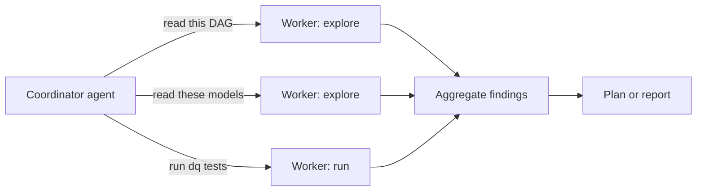
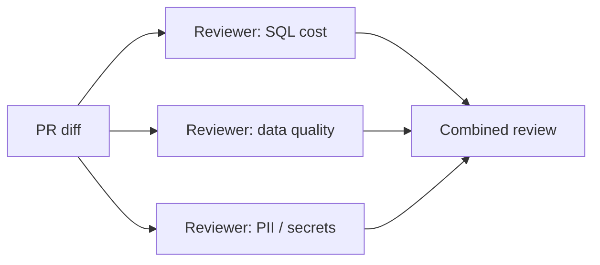
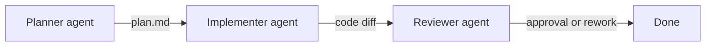

# Module 7 — Sub-agents & Orchestration Patterns

By now you have all six customization primitives — instructions, prompt files, hooks, agents, skills, and MCP — plus the ability to package them as plugins ([Module 6](06-skills-and-plugins.md)). This module is about **composing** them: how one agent invokes another, the four patterns that show up in practice, and when **not** to reach for sub-agents at all.

Sub-agents are now first-class in VS Code. They are the bridge between "one agent, one chat" and the multi-agent workflows that real codebases need.

---

## 1. Sub-agents — what, why, when

A **sub-agent** is one agent invoked by another agent for a bounded task (search, review, run a tool), with its own fresh context. The main agent gets back a structured result, not the sub-agent's entire transcript.

Why this matters:

- **Context budget.** Reviewing a 30-model dbt project, a 4,000-row notebook, or a long SQL pipeline blows past the main agent's context. A sub-agent reads the long thing and returns a summary.
- **Specialization.** Different work needs different tools and personas (planner vs. implementer vs. reviewer).
- **Parallelism.** Independent sub-tasks run in parallel.
- **Safety.** A read-only sub-agent can explore freely; the main agent stays under tight tool restrictions.

When **not** to use a sub-agent:

- The task takes one or two file reads — just read the files in the main turn.
- The work is sequential and depends on intermediate decisions — sub-agents are most useful when you can describe the whole job upfront.

Tunables (see [VS Code subagents docs](https://code.visualstudio.com/docs/copilot/agents/subagents)):

- `chat.subagents.allowInvocationsFromSubagents` — allow recursion (default off).
- Max depth: 5.
- Declare which agents a parent can invoke via the `agents:` property in `.agent.md` frontmatter.

---

## 2. The four orchestration patterns to know

### 2.1 Coordinator / worker (fan-out)

Main agent breaks a job into N independent sub-jobs, dispatches them in parallel to worker agents, then aggregates.



DE example: review every dbt model touched in a PR — one sub-agent per model, returning `{model, smells, suggestions}`. Coordinator merges into a single review comment.

### 2.2 Multi-perspective review (parallel critics)

Same input, multiple specialized reviewers, structured outputs joined into a checklist.



DE example: PR review where one sub-agent checks SQL warehouse cost smells, one checks dbt-test coverage, one checks for PII leaks in new SELECTs.

### 2.3 Planner → implementer → reviewer (pipeline)

Sequential, each stage produces an artifact the next stage consumes. Mirrors Spec Kit's `/specify → /plan → /tasks → /implement → /analyze` flow but kept in one VS Code session.



Use when a single human is driving the whole flow and Spec Kit's full ceremony is too heavy.

### 2.4 Recursive divide-and-conquer

A sub-agent decides whether the job is small enough to do itself or further splits. Requires `allowInvocationsFromSubagents: true` and a careful depth limit.

DE example: "modernize this 4,000-line notebook" → splits into cells → splits cells into refactor units → each leaf cell is refactored by a focused worker. Use sparingly; cost grows fast.

---

## 3. Declaring sub-agents in this repo

In a custom agent's frontmatter:

```yaml
---
name: data-pipeline-reviewer
description: Reviews dbt/SQL/Spark changes for cost, quality, and PII safety.
model: claude-sonnet-4.6
tools: [read_file, grep_search, file_search, get_errors]
agents:
  - sql-cost-reviewer
  - dq-coverage-reviewer
  - pii-scanner
---
```

The main agent can then invoke `sql-cost-reviewer` etc. via the `runSubagent` tool, while remaining read-only itself.

---

## 4. Patterns we use in this repo

| Pattern | Where to find it |
|---|---|
| Coordinator / worker | `data-pipeline-reviewer` (in the DE track) can fan out read-heavy model reviews to the built-in Explore subagent |
| Multi-perspective review | Same agent, three specialized reviewers as sub-agents |
| Planner → implementer | Plan Mode → Agent Mode (built-in handoff) |
| Pipeline with Spec Kit | `/speckit.plan → /speckit.tasks → /speckit.implement → /speckit.analyze` |

---

## 5. See also

- [Module 15 — Lab 15: Add a second reviewer agent and chain it](15-workshop-and-labs.md#lab-15--add-a-second-reviewer-agent-and-chain-it) — the hands-on for this module
- [Module 5 — Custom Agents, Skills & MCP](05-customize-agents-skills-mcp.md) — custom agent basics
- [Module 9 — Roles, RACI & Spec Sizing](09-roles-and-spec-sizing.md) — when work is too big for one agent
- [Module 11 — Agent Mode Adoption Checklist](11-agent-mode-checklist.md) — the human-in-the-loop rules that still apply when sub-agents are in play
- [VS Code sub-agents docs](https://code.visualstudio.com/docs/copilot/agents/subagents)
- [VS Code custom agents docs](https://code.visualstudio.com/docs/copilot/customization/custom-agents)

---

> **Next:** [Module 8 — Spec-Driven Development](08-spec-driven-development.md)
> **Back:** [Module 6 — Skills Portfolio, Packaging & Sharing](06-skills-and-plugins.md)
